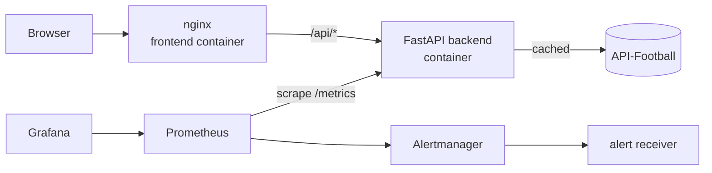

# Football Match Hub

A football (soccer) web app with live scores, fixtures, league tables, team and player profiles,
player comparison and head-to-head search, in English and Vietnamese.
It is delivered through a **7-stage Jenkins CI/CD pipeline** (SIT223/SIT753 Task 7.3HD).

| Layer | Technology |
|---|---|
| Frontend | Vue 3, Vite, Pinia, Vue Router (PWA) served by nginx |
| Backend | Python FastAPI: proxy + tiered cache in front of [API-Football](https://www.api-football.com/), rate limiting (slowapi), Prometheus metrics |
| Data | API-Football (production) or built-in mock data (tests, CI, staging) |
| CI/CD | Jenkins (declarative `Jenkinsfile`), Docker, Docker Compose |
| Quality & security | pytest, Vitest, SonarCloud, Bandit, pip-audit, npm audit, Trivy |
| Monitoring | Prometheus, Alertmanager, Grafana |

The backend sits between the browser and API-Football, so the **API key never reaches the frontend**,
and a shared cache keeps the number of paid API calls low.

## Architecture



## CI/CD pipeline

`Jenkinsfile` defines 7 stages. Every stage has a **gate**: if it fails, the pipeline stops and nothing reaches production.

| # | Stage | What happens | Gate |
|---|---|---|---|
| 1 | **Build** | Python venv + dependencies, `npm ci`, Vite production build, Docker images `fmh-backend` and `fmh-frontend` tagged `1.0.<build>-<commit>` | Any build error |
| 2 | **Test** | 75 backend tests (pytest: unit, integration, security, smoke) and 28 frontend tests (Vitest); JUnit + coverage reports published in Jenkins | Any failing test |
| 3 | **Code Quality** | SonarCloud analysis (bugs, code smells, duplication, coverage) | SonarCloud Quality Gate |
| 4 | **Security** | Bandit (Python SAST), pip-audit and npm audit (dependencies), Trivy (Docker images and Dockerfiles); reports archived | See thresholds below |
| 5 | **Deploy** | Staging environment with Docker Compose (`deploy/`), mock data | Smoke test: health, version, frontend, API proxy |
| 6 | **Release** | Manual approval, production with the real API key from Jenkins Credentials, Git tag `v1.0.<build>` pushed to GitHub | Smoke test, **automatic rollback** to the previous version on failure |
| 7 | **Monitoring** | Prometheus + Alertmanager + Grafana (`monitoring/`) | Production must be scraped and all alert rules loaded |

**Security gate thresholds** (`ci/security_scan.sh`):

| Tool | Fails the build on |
|---|---|
| Bandit | MEDIUM or HIGH severity issue |
| pip-audit | any known vulnerability |
| npm audit | HIGH or CRITICAL in production dependencies |
| Trivy image | CRITICAL vulnerability with a fix available |
| Trivy config | HIGH or CRITICAL Dockerfile misconfiguration |

## Environments

| Environment | URL | Data | Started by |
|---|---|---|---|
| Staging | http://localhost:8081 | mock | Deploy stage |
| Production | http://localhost:8088 | API-Football | Release stage |
| Grafana | http://localhost:3000 | dashboard | Monitoring stage |
| Prometheus | http://localhost:9090 | metrics, alert rules | Monitoring stage |
| Alertmanager | http://localhost:9093 | alert routing | Monitoring stage |

Staging and production use the **same** `deploy/docker-compose.yml`; only the env file differs
(`deploy/staging.env`, `deploy/prod.env`).

## Monitoring and alerts

The backend exposes `/metrics` (request count and latency per route, API-Football calls, cache hits).
Alert rules (`monitoring/prometheus/alerts.yml`):

| Alert | Condition |
|---|---|
| BackendDown | backend not reachable for 30 s |
| HighErrorRate | more than 5% of requests return 5xx for 1 min |
| HighLatencyP95 | p95 latency above 2 s for 5 min |
| UpstreamApiErrors | more than 5 failed API-Football calls in 5 min |

Notifications are sent by Alertmanager to a webhook receiver: `docker logs -f fmh-monitoring-alert-receiver-1`.

**Incident simulation:** `docker stop fmh-prod-backend-1`. After about 30 s `BackendDown` fires in
Prometheus, Grafana shows the backend as DOWN and the receiver logs the notification.
`docker start fmh-prod-backend-1` resolves it.

**Rollback demo:** run the job with the parameter `SIMULATE_BAD_RELEASE = true`. The release deploys a broken
configuration, the production smoke test fails and `ci/release.sh` restores the previous version.

## Running the pipeline

Requirements on the Jenkins machine: Docker Desktop, Python 3.10+, Node.js 20.19+, Git.

Jenkins credentials:

| ID | Type | Used for |
|---|---|---|
| `SONAR_TOKEN` | Secret text | SonarCloud analysis |
| `API_FOOTBALL_KEY` | Secret text | Production API key |
| `github-token` | Username + personal access token | Pushing release tags |

Create a Pipeline job with *Pipeline script from SCM* pointing to this repository (`Jenkinsfile` on `main`).

## Running locally

```bash
# Backend (http://localhost:8000, docs at /docs)
cd backend
python3 -m venv .venv && source .venv/bin/activate
pip install -r requirements-dev.txt
cp .env.example .env          # leave API_FOOTBALL_KEY empty to use mock data
uvicorn main:app --reload
python -m pytest              # run the tests

# Frontend (http://localhost:5173, /api is proxied to the backend)
cd frontend
npm install
npm run dev
npm test
```

## Repository structure

```
backend/      FastAPI app, tests/, Dockerfile
frontend/     Vue 3 app, tests/, Dockerfile, nginx.conf
deploy/       Docker Compose stack + staging/production settings
monitoring/   Prometheus, Alertmanager, Grafana configuration
ci/           Pipeline scripts: security scan, smoke test, release with rollback, monitoring check
Jenkinsfile   The 7-stage pipeline
sonar-project.properties
```
